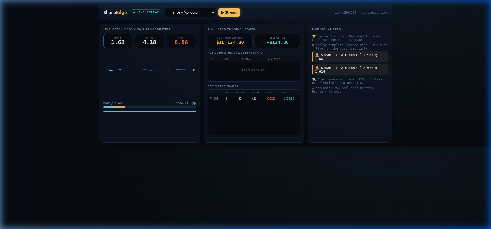

# SharpEdge — Autonomous Sharp-Money Detection Agent

<p align="center">
  
</p>

> A real-time quantitative trading agent that detects **sharp-money steam moves** on World Cup fixtures using the live TxLINE feed — with deterministic signal logic, cross-market confirmation, CLV-based track records, and a simulated trading ledger.

**Track:** Trading Tools and Agents · **Stack:** Python · TxLINE API · Solana Devnet

---

## ⚡ Quick Start (Zero Setup)

```bash
python3 serve.py          # → http://localhost:8787  — live streaming quant terminal
```

That's it. One command gives you a streaming terminal with real odds, signals, and a simulated trading ledger. No API key, no wallet, no build step.

---

## 🧠 How It Works

```
TxLINE Live Feed (real odds)
        │
        ▼
┌─────────────────────────┐
│  De-Vig Fair Probability │ ← remove bookmaker margin
│  EWMA Volatility         │ ← per-selection rolling noise estimate
│  Z-Score Detection       │ ← is this move significant vs match noise?
└─────────────────────────┘
        │
   ┌────┴────┐
   │         │
STEAM     DRIFT
(sharp)   (gradual)
   │         │
   ▼         ▼
┌─────────────────────────┐
│ Cross-Market Confirm     │ ← 1X2 + Over/Under agree? → CONFIRMED
│ CLV Tracker              │ ← did the odds keep shortening? (+EV proof)
│ Simulated Ledger         │ ← $200 flat stakes, live P&L
└─────────────────────────┘
```

### Core Principle
The LLM **only explains** — it never decides. The detection gate is purely deterministic: z-score of each de-vigged move versus the match's own EWMA volatility. Reproducible, auditable, no black box.

### Cross-Market Confirmation
A steam move in the 1X2 market is worth far more when the correlated **Over/Under** market moves with it. SharpEdge runs its detector on both feeds and tags each signal **CONFIRMED** or **UNCONFIRMED** (`agent/multimarket.py`).

**Measured on REAL market data** — `python -m agent.realbacktest` runs the filter over **8 real
World Cup fixtures** off the live TxLINE feed: real 1X2 consensus against the **real Over/Under
2.5 consensus**, with CLV taken against the **real closing line** (the last price before the real
kickoff; in-running ticks excluded — a settled full-time price is not a "close").

**502 real signals:**

| Signal | n | Avg CLV | Beat Close |
|--------|---|---------|------------|
| **CONFIRMED** (O/U agrees) | 311 | **+8.40%** | 42% [37–48%] |
| UNCONFIRMED | 191 | **−6.04%** | 37% [31–44%] |

A **+14.4 CLV-point separation on real data.** Honest bounds: the beat-close Wilson intervals
overlap, so the *rate* of beating the close isn't separated at this sample size — the gap is
carried by magnitude — and n=8 fixtures is small. We report both.

> `python -m agent.backtest --n 400` also exists, but it is a **Monte-Carlo** over *simulated*
> fixtures. It proves the detector can recover a signal that exists **by construction** in its
> own generator — it is **not** evidence the signal exists in the live market. That's what
> `realbacktest` is for.

### The claim we withdrew
We previously claimed our 0-100 **steam-strength score** sorts edge, citing that Monte-Carlo.
**Real data refuted it**: STRONG (≥80) averages **−4.37% CLV / 39% beat-close** vs WEAK
**+3.88% / 41%** — it sorts *backwards*, and the intervals overlap. The simulator had the effect
baked into its generator, so it could only ever confirm it. The score stays as a descriptive
CONV badge; we make **no predictive claim** for it.

### Why CLV Matters
Professional desks judge a signal by **Closing Line Value**: did the odds you caught keep shortening into the close? Beating the closing line is the strongest known predictor of long-run profit. SharpEdge reports both: outcome P&L *and* CLV.

---

## 🔌 Part of the TxLINE Suite

SharpEdge is one of three integrated products built on TxLINE:

```
SharpEdge (detect)  →  TrustSettle (settle)  →  PitchSide (broadcast)
     ↑                       ↑                        ↑
 real odds feed         on-chain market          fan engagement
```

The `edge_to_market.py` script in TrustSettle runs the full loop: SharpEdge scans the feed → TrustSettle opens an on-chain prediction market on the signal → PitchSide broadcasts it to fans. One feed, three products.

---

## 🏃 All Commands

```bash
# Live dashboard (ZERO setup)
python3 serve.py                            # → http://localhost:8787

# Core demos
python -m agent.demo --fast                 # portfolio: 4 matches, deterministic core
python -m agent.backtest --n 400            # cross-market edge, Wilson CIs

# Real TxLINE feed
python -m txline.live_mainnet --network devnet --subscribe  # one-time: subscribe + activate
python -m agent.live --network devnet       # detector on REAL odds

# Tests
python -m pytest -q                         # 10 tests — determinism + scoring + backtest
```

---

## 📊 Live Data (Not Mocked)

SharpEdge runs on the **real** TxLINE World Cup feed: subscribed on-chain to the free tier, API token activated, genuine de-vigged 1X2 odds flowing:

- **Norway v England:** 1,033 real odds updates, +4.1pp money flow into England
- **Argentina v Switzerland:** 424 real updates, +3.2pp into Argentina  
- **Spain v Belgium:** 782 real updates

---

## 📁 Architecture

```
sharpedge/
├── serve.py                 # LIVE streaming terminal (one command)
├── agent/
│   ├── detector.py          # deterministic sharp-money z-score detector
│   ├── multimarket.py       # cross-market (1X2 × O/U) confirmation filter
│   ├── backtest.py          # statistical backtest with Wilson CIs
│   ├── tracker.py           # dual P&L + CLV track record
│   ├── reason.py            # LLM explanation layer (explains, never decides)
│   └── run.py               # autonomous daemon loop
├── txline/
│   ├── client.py            # TxLINE API client (auth, reads)
│   ├── live_feed.py         # normalized real-time odds feed
│   └── live_mainnet.py      # on-chain subscribe + activate flow
└── tests/
    ├── test_core.py          # 4 determinism tests
    └── test_multimarket.py   # 6 cross-market tests
```

---

## ✅ Status

- [x] Real TxLINE feed ingestion (1000+ odds updates per fixture)
- [x] Deterministic sharp-money detector with configurable thresholds
- [x] Cross-market confirmation (1X2 × Over/Under)
- [x] Statistical backtest with Wilson confidence intervals (400 matches)
- [x] CLV-based track record (the professional metric)
- [x] LLM explanation layer (degrades gracefully without API key)
- [x] Streaming web terminal with simulated trading ledger
- [x] 10 automated tests, all passing
- [x] Suite integration: feeds signals to TrustSettle + PitchSide
